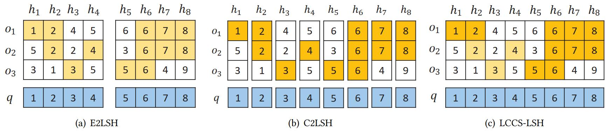
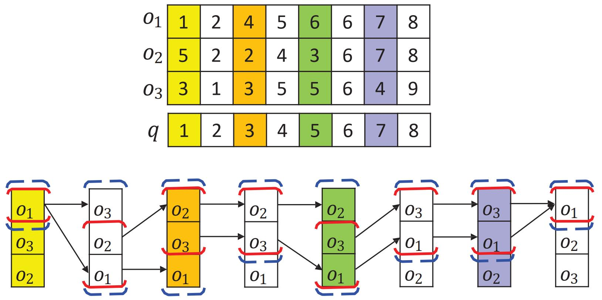
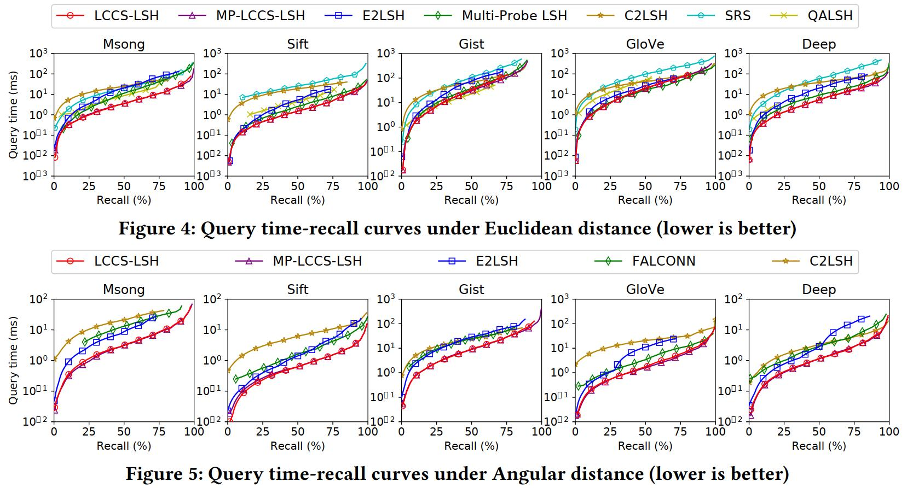

# LCCS-LSH: LSH Scheme based on Longest Circular Co-Substring

<p align="center"></p>

Welcome to the **LCCS-LSH** GitHub!

**LCCS-LSH** is a toolbox for the problem of Nearest Neighbor Search (NNS). Given a set of data points and a query, the problem of NNS aims to find the nearest data point to the query. It has plenty of applications in databases, data mining, machine learning, etc. 

This toolbox provides the implementations and experiments of our work [Locality-Sensitive Hashing Scheme based on Longest Circular Co-Substring](https://dl.acm.org/doi/abs/10.1145/3318464.3389778) in [SIGMOD 2020](https://sigmod2020.org/). 
We implement [E2LSH](https://dl.acm.org/doi/10.1145/997817.997857) and [C2LSH](https://dl.acm.org/doi/10.1145/2213836.2213898) in this toolbox. It also includes four state-of-the-art LSH schemes, i.e., [Multi-Probe LSH](https://www.vldb.org/conf/2007/papers/research/p950-lv.pdf), [SRS](http://www.vldb.org/pvldb/vol8/p1-sun.pdf), [QALSH](https://dl.acm.org/doi/10.1007/s00778-017-0472-7), and [FALCONN](https://dl.acm.org/doi/10.5555/2969239.2969376).

## Datasets and Queries

We use five real-life [datasets](https://1drv.ms/u/s!Ascf3jEjrVdxg6c6w7CutkF0TpXgpA?e=fjnR80) Msong, Sift, Gist, GloVe, and Deep in the experiments. For each dataset, we randomly select 100 objects from their test sets and use them as queries for evaluations. The statistics of datasets and queries are summarized as follows.

| Datasets  | #Data Objects | Dimensionality | #Queries | Data Size | Type   |
| --------- | ------------- | -------------- | -------- | --------- | ------ |
| Msong     | 992,272       | 420            | 100      | 1.6  GB   | Audio  |
| Sift      | 77,079        | 128            | 100      | 488.3 MB  | Image  |
| Gist      | 1,000,000     | 960            | 100      | 3.6 GB    | Image  |
| GloVe     | 1,183,514     | 100            | 100      | 451.5 MB  | Text   |
| Deep      | 1,000,000     | 256            | 100      | 976.6 MB  | Deep   |

## Dependency

This toolbox requires ```g++-8``` with ```c++17``` support. Before the compilation, please check whether the `g++-8` is installed. If not, please install it first. We provide a way to install `g++-8` in Ubuntu 18.04 as follows.

```bash
sudo add-apt-repository ppa:ubuntu-toolchain-r/test
sudo apt-get update
sudo apt-get install g++-8
sudo apt-get install gcc-8 (optional)
```

In order to compile the program, you should have the dependencies of **Boost** and **GSL** (required by lshkit). For example, for Ubuntu 18.04 users, you can install GSL, Boost, and its program_options with the following commands:

```bash
sudo apt-get install libboost-dev
sudo apt-get install libboost-program-options-dev
sudo apt-get install libgsl-dev
```

Other dependencies should be already included in this repository.

## Compilation

When the dependencies have been included, you could build the project with the following instructions:

Step 1. build lib for Multi-Probe LSH (lshkit) and get `lshkit-0.2.1/build/lib/liblshkit.a`:

```bash
cd lshkit-0.2.1/build
cmake ..
make -j
```

Step 2. build lib for SRS and get `SRS/libsrs.a`:

```bash
cd SRS
make libsrs.a
```

Step 3. build lib for QALSH and get `QALSH_Mem/libqalsh.a`:

```bash
cd QALSH_Mem
make libqalsh.a
```

Step 4. combine together and build LCCS-LSH

```bash
mkdir build
cd build
cmake ..
make -j
```

Once finished, it will output an `lccs` binary file. You can use the following command for simple help information.

```bash
./lccs -h
```

## Reproductivity

At the beginning, we first illustrate the idea of LCCS-LSH. Similar to E2LSH, we perform concatenation of K LSH functions. However, we also reuse these K LSH functions with the idea of **circular ring**, i.e., consider different positions as the start positions and find the substring as long as possible as the concatenation. The following figure shows an example of the LCCS search framework of LCCS-LSH.

<p align="center"></p>

We provide the Mnist dataset as a simple example. To run the LCCS-LSH algorithm on the Mnist data, you can simply run the following instructions in the `build/` folder (Python 3.x required):

```python
python ../scripts/run_simple_experiment.py
```

This will work like a shell scirpt and invode the program using command line.

To reproduce all of the experiments in our SIGMOD 2020 paper, you should first download the [datasets](https://1drv.ms/u/s!Ascf3jEjrVdxg6c6w7CutkF0TpXgpA?e=fjnR80) and store them in the data folder properly like Mnist. Once the datasets are properly prepared, you can simply run (in the `build/` folder as well): 

```python
python ../scripts/run_ground_truth.py
python ../scripts/run_time_recall.py
```

## Figures

Finally, we provide the plot scripts to draw figures, which can be found in `scripts/lccs_plot/`. To reproduce the figures that appeared in our SIGMOD 2020 paper, you can run (in the `scripts/lccs_plot/` folder):

```python
python plot_sigmod.py
```

In order to run the scripts, you may need *numpy*, *scipy* and *matplotlib*. The scripts will automatically use the latest result indicated by the timestamp in the result file name. Some results are shown as follows.

<p align="center"></p>

## Reference

Please use the following bibtex to cite this work when you use **LCCS-LSH** in your paper.

```tex
@inproceedings{lei2020locality,
  title={Locality-Sensitive Hashing Scheme based on Longest Circular Co-Substring},
  author={Lei, Yifan and Huang, Qiang and Kankanhalli, Mohan and Tung, Anthony KH},
  booktitle={Proceedings of the 2020 ACM SIGMOD International Conference on Management of Data},
  pages={2589--2599},
  year={2020}
}
```

It is welcome to contact me (huangq@comp.nus.edu.sg) or Yifan (leiyifan@comp.nus.edu.sg) if you meet any issue. Thank you.
